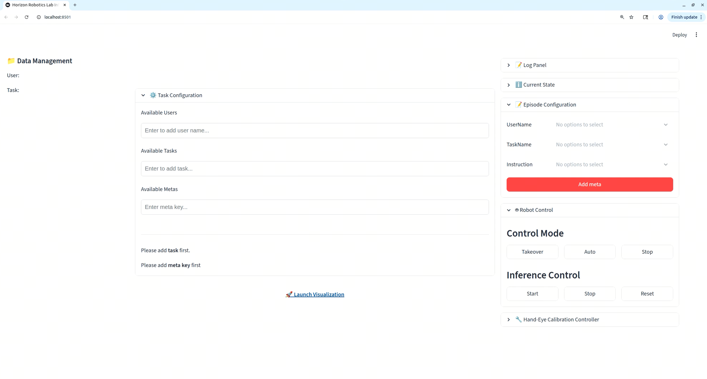

Application
============
RoboOrchardApp is a lightweight application designed as the primary interface for real-robot functionalities within the HoloBrain ecosystem. It contains the following features:

- [:doc:`handeye_calib`] Robot arm hand-eye calibration.
- [:doc:`data_collection`] Data Collection.
- [:doc:`inference`] Deployment of VLA Models.
- [:doc:`teleop`] Teleoperation control of robot arms.
- It also includes a Foxglove visualization interface for real-time data display and logging.

   RoboOrchardApp Homepage