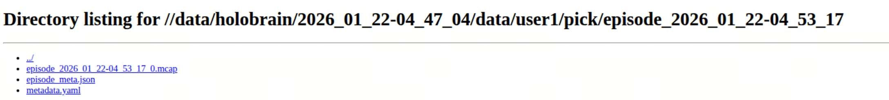
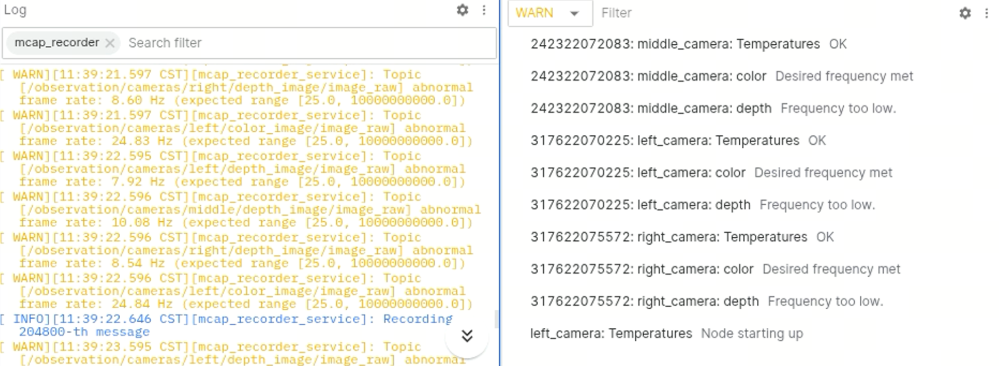

Data Collection
===============

We developed an mcap-based (`mcap.dev <https://mcap.dev/>`_) data collection system that records both expert demonstrations and on-policy model rollouts.

.. figure:: ../_static/flowcharts/data_recorder.jpeg
   :alt: data collection flowchart
   :align: center

   Data Collection Flowchart

1. Structured Data & Metadata Management
----------------------------------------

* **Comprehensive Annotation**: 
  The system supports detailed annotation management, allowing for the explicit definition of user identities, task names, and specific task instructions.

* **Hierarchical Data Organization**: 
  Recorded data is structured systematically following the directory logic: 
  ``{app_init_time}/{username}/{task_name}/{episode_timestamp}``. Each episode package includes:
  
  * Raw ``MCAP`` data files.
  * Associated ``mcap_meta`` for stream indexing.
  * An extended ``episode_meta.json`` for high-level experiment metadata.

   Sample Directory Tree

* **Extensible Metadata**: 
  The system offers extensible meta-key configurations to accommodate project-specific metadata requirements.

.. figure:: ../_static/images/meta_config.gif
   :alt: metadata configuration
   :align: center

   Sample Metadata Configuration

2. Data Quality & Transmission Optimization
-------------------------------------------

* **Bandwidth Optimization**: 
  To mitigate bottlenecks in multi-sensor configurations, the system incorporates real-time, on-the-fly image compression and encoding.

* **Active Diagnostics**: 
  A dedicated diagnostic suite monitors frame rates in real-time. It provides instant alerts for data anomalies, such as camera frame drops or node failures, ensuring the integrity of the collected dataset.

   Active Diagnostics

3. Visualization & Playback Interfaces
--------------------------------------

* **Real-time Visualization**: 
  We provide an integrated entrance for real-time data streaming and visualization through **Foxglove**, enabling live monitoring of robot states and sensor feeds.

* **Seamless Playback**: 
  A lightweight ``file_server`` is integrated into the pipeline, supporting the immediate playback and review of recorded sequences for rapid data verification.

.. grid:: 2
   :gutter: 3
   
   .. grid-item::
      .. figure:: ../_static/images/vis.gif
         :alt: data visualization
         :align: center

         Real-time Visualization

   .. grid-item::
      .. figure:: ../_static/images/replay.gif
         :alt: data replay
         :align: center

         Data Replay 
