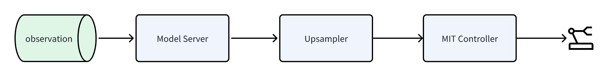
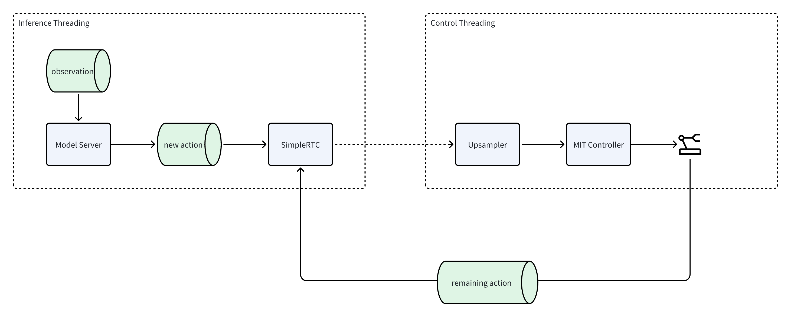

Inference & Deployment
======================

- We provide an inference deployment system that supports both synchronous inference and asynchronous inference via SimpleRTC.
- By simply wrapping your model as a Server, you can enable communication with deployment nodes, facilitating local or even remote (cross-machine) synchronous/asynchronous inference deployment.
- The system integrates with the app to allow inference start/stop and takeover, supporting workflows such as DAgger-style data collection.

    Synchronous Inference Deployment Flowchart

    Asynchronous Inference Deployment Flowchart