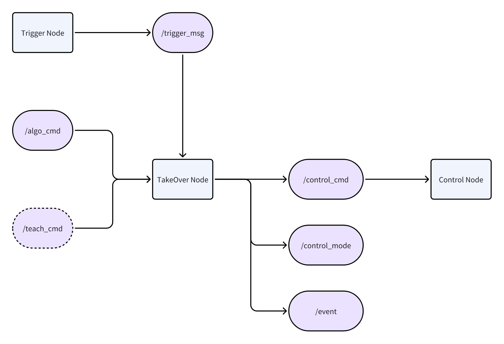

Teleoperation
=============

We implement a control mode switching mechanism for robot arms via ROS Bridge, which is further complemented by an integrated mobile application for seamless transitions. 

   Teleoperation Flowchart

The system supports three distinct operational modes:

- Autonomous Mode: The manipulator is governed by commands generated from high-level algorithms.

- Intervention Mode: Facilitates human-in-the-loop control, supporting teleoperation frameworks such as ALOHA.

- Stop Mode: Ensures the safety of the system by immediately terminating all robotic motions.

.. figure:: ../_static/images/takeover.gif
   :alt: teleoperation
   :align: center

   Sample Teleoperation Process