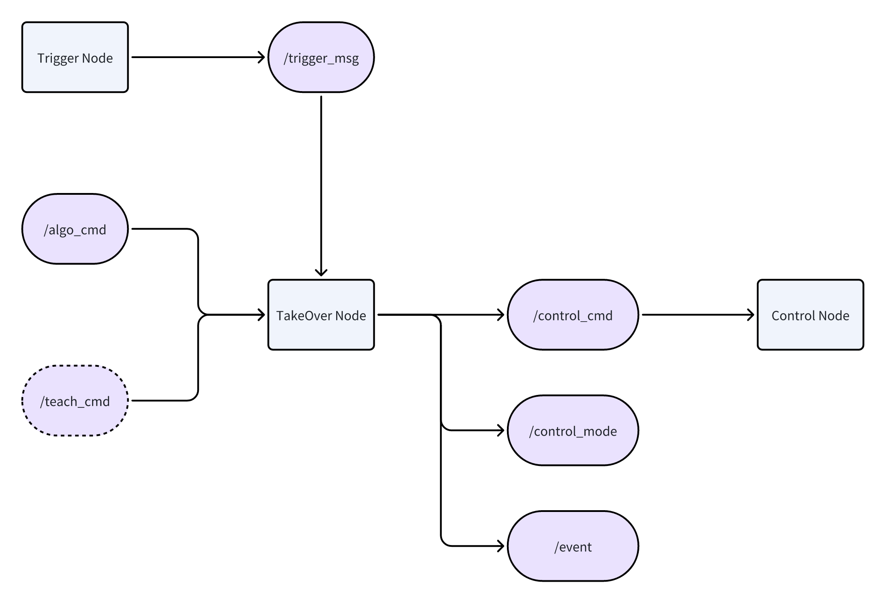

Teleoperation
=============

We implement a control mode switching mechanism for robot arms via ROS Bridge, which is further complemented by an integrated mobile application for seamless transitions.

   Teleoperation Flowchart

The system supports three distinct control modes:

- Autonomous Mode: The manipulator is governed by commands generated from high-level algorithms.

- Takeover Mode: Facilitates human-in-the-loop control, supporting teleoperation frameworks such as ALOHA and Pico VR.

- Stop Mode: Ensures the safety of the system by immediately terminating all robotic motions.

The default HoloBrain launch configuration targets ALOHA hardware. It uses
``teleop/aloha_dagger.sh`` and app services under
``/robot/*/aloha_orchestrator``. Pico VR uses ``teleop/pico_dagger.sh`` for
DAgger workflows. Set ``TELEOP_SOURCE=pico`` so the launch template starts the
Pico script and the app targets ``/robot/*/vr_orchestrator`` services.

.. note::

   In ALOHA mode, the application guards control mode transitions with the status of the master arms:

   - Before switching to Takeover Mode, both master arms must be in a valid teach state for takeover.
   - Before switching back to Autonomous Mode, the system checks the master arm status again and recovers the master control mode first when needed.
   - When a master arm is re-enabled from teach mode, the control chain no longer forces an extra reset step.

Reset behavior is defined by the inference app launch configuration. In the
default ALOHA setup, it resets both master and puppet arms. In Pico mode, it
resets only the puppet arms.

.. figure:: ../_static/images/takeover.gif
   :alt: teleoperation
   :align: center

   Sample Teleoperation Process
