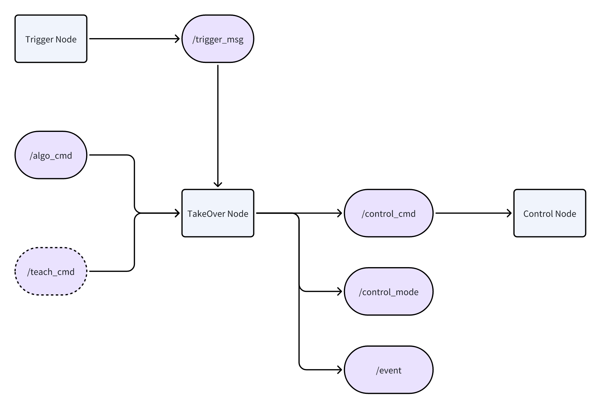

Teleoperation
=============

We implement a control mode switching mechanism for robot arms via ROS Bridge, which is further complemented by an integrated mobile application for seamless transitions.

   Teleoperation Flowchart

The system exposes four control states:

- Autonomous Mode: The manipulator is governed by commands generated from high-level algorithms.

- Takeover Mode: Facilitates human-in-the-loop control, supporting teleoperation frameworks such as ALOHA and Pico VR.

- Stop Mode: Closes command forwarding; it does not stop hardware or issue an emergency stop.
- Resetting: Closes command forwarding while inference is paused and hardware is reset.

The default HoloBrain launch configuration targets ALOHA hardware. It uses
``teleop/aloha_dagger.sh``. Pico VR uses ``teleop/pico_dagger.sh`` for DAgger
workflows. Set ``TELEOP_SOURCE=pico`` so the launch template starts the Pico
script. Both runtimes generate their Control Manager configuration from the
same command-channel definitions used by Deploy and expose the global
``/robot/control/auto``, ``takeover``, ``stop``, and ``reset`` services.

.. note::

   The inference Start and Stop buttons still call the Deploy enable and
   disable services directly. Switching the Manager to Autonomous Mode does
   not start Deploy.

Reset ordering is owned by the Control Manager. It disables inference before
resetting hardware; ALOHA resets both master and puppet arms, while Pico resets
only the puppet arms. The inference app issues one global reset request and
does not repeat that orchestration itself.

.. figure:: ../_static/images/takeover.gif
   :alt: teleoperation
   :align: center

   Sample Teleoperation Process
